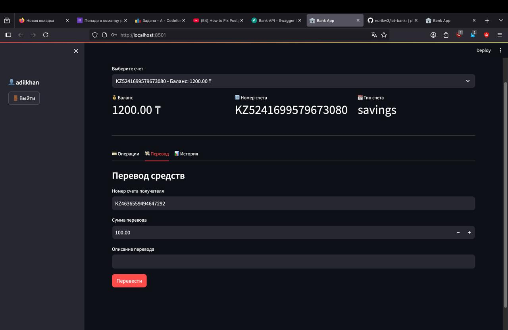
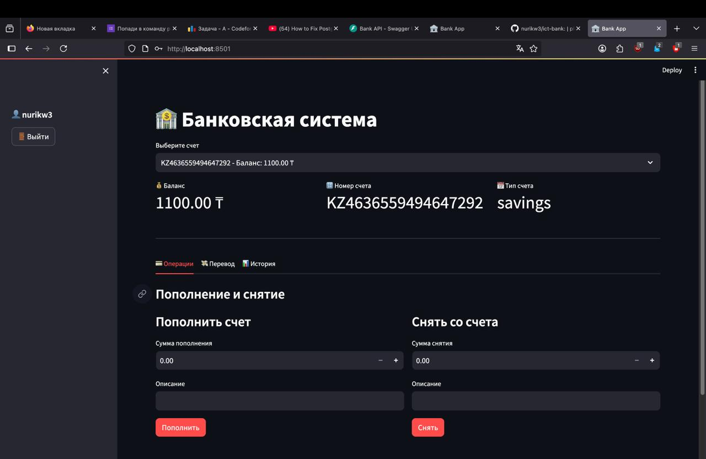
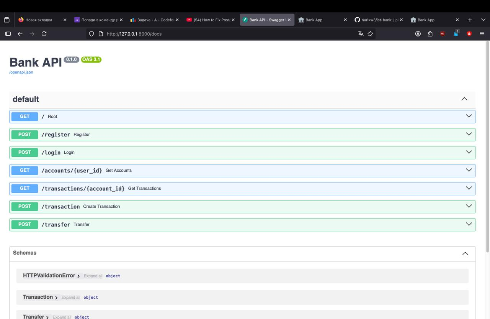

# 🏦 Bank App - Banking Web Application

Full-featured banking application built with **FastAPI + Streamlit + PostgreSQL** with authentication system.

## 📸 Preview







## ✨ Features

- 🔐 **Registration and Authentication** with bcrypt encryption
- 💰 **Bank Account Management**
- 💳 **Deposit and Withdrawal**
- 💸 **Transfer Between Accounts**
- 📊 **Transaction History**
- 🛡️ **SQL Injection Protection** (parameterized queries)
- 🗄️ **PostgreSQL Database**

## 🚀 Quick Start

### 1. Install Dependencies

```bash
pip install -r requirements.txt
```

### 2. Setup PostgreSQL

**Create database:**
```sql
CREATE DATABASE bank_db;
```

**Configure connection:**

Create `.env` file:
```env
DB_HOST=localhost
DB_NAME=bank_db
DB_USER=postgres
DB_PASSWORD=your_password
```

Or change password directly in `main.py`:
```python
password=os.getenv("DB_PASSWORD", "root")  # ← your password
```

### 3. Run Application

**Terminal 1 - Backend (FastAPI):**
```bash
python main.py
```
Server will start at http://localhost:8000

**Terminal 2 - Frontend (Streamlit):**
```bash
streamlit run app.py
```
Interface will open at http://localhost:8501

## 📁 Project Structure

```
ict-bank/
├── main.py           # FastAPI backend with API endpoints
├── app.py            # Streamlit frontend interface
├── requirements.txt  # Python dependencies
├── .env             # Database configuration (create yourself)
└── README.md        # Documentation
```

## 🗄️ Database Structure

### Table `users`
```sql
id | username | password_hash | full_name | created_at
```

### Table `accounts`
```sql
id | user_id | account_number | balance | account_type | created_at
```

### Table `transactions`
```sql
id | account_id | transaction_type | amount | description | created_at
```

## 💡 Usage

### Registration
1. Open "Registration" tab
2. Enter login, password and full name
3. Account is automatically created with balance **1000₸**

### Account Operations
- **Deposit**: "Operations" tab → Deposit
- **Withdrawal**: "Operations" tab → Withdraw
- **Transfer**: "Transfer" tab → enter recipient's account number

### History
All transactions are displayed in "History" tab with types:
- 📥 Deposit
- 📤 Withdrawal
- ⬅️ Incoming Transfer
- ➡️ Outgoing Transfer

## 🔍 Working with Database

### Connect via terminal:
```bash
psql -U postgres -d bank_db
```

### Useful commands:
```sql
-- Show all tables
\dt

-- View users
SELECT * FROM users;

-- View accounts
SELECT * FROM accounts;

-- Transaction history
SELECT * FROM transactions ORDER BY created_at DESC;

-- Exit
\q
```

## 📝 API Endpoints

| Method | Endpoint | Description |
|--------|----------|-------------|
| GET | `/` | API Status |
| POST | `/register` | User Registration |
| POST | `/login` | Login |
| GET | `/accounts/{user_id}` | Get User Accounts |
| GET | `/transactions/{account_id}` | Transaction History |
| POST | `/transaction` | Create Transaction |
| POST | `/transfer` | Transfer Between Accounts |

**API Documentation:** http://localhost:8000/docs

## 🔐 Security

- ✅ **Password Hashing** using bcrypt
- ✅ **SQL Injection Protection** via parameterized queries
- ✅ **Data Validation** at Pydantic model level
- ✅ **Balance Verification** before transactions

## 🛠️ Technologies

- **Backend:** FastAPI, uvicorn
- **Frontend:** Streamlit, pandas
- **Database:** PostgreSQL, psycopg2
- **Security:** passlib, bcrypt
- **API:** RESTful API with auto-documentation


## 📦 Dependencies

```
fastapi==0.104.1
uvicorn==0.24.0
psycopg2-binary==2.9.9
pydantic==2.5.0
passlib==1.7.4
bcrypt==4.1.1
python-multipart==0.0.6
python-dotenv==1.0.0
streamlit==1.28.1
requests==2.31.0
pandas==2.1.3
```

## 📞 Contact

Educational project for ICT course
BDA-2508
